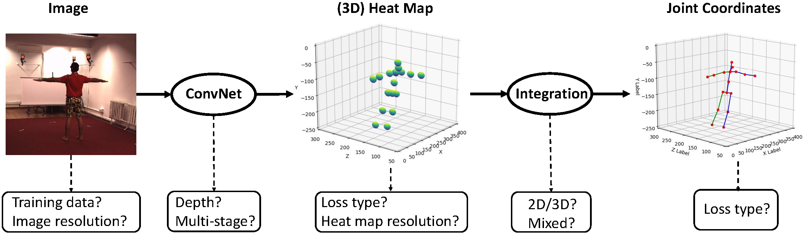
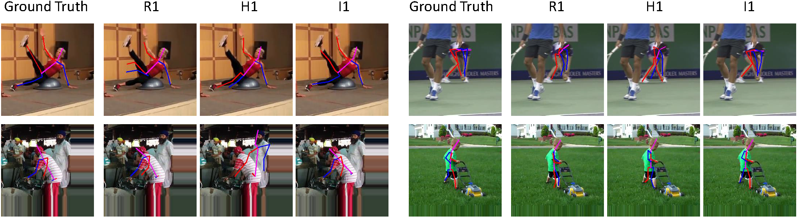

# Integral Human Pose Regression

The major contributors of this repository include [Xiao Sun](https://jimmysuen.github.io/), [Chuankang Li](https://github.com/lck1201), [Bin Xiao](https://github.com/leoxiaobin), [Fangyin Wei](https://weify627.github.io/), [Yichen Wei](https://github.com/YichenWei).

## Introduction

**Integral Regression** is initially described in an [ECCV 2018 paper](https://arxiv.org/abs/1711.08229). ([Slides](https://jimmysuen.github.io/slides/xiaosun_integral_human_pose_regression.pptx)).

We build a [3D pose estimation system](https://arxiv.org/abs/1809.06079) based mainly on the Integral Regression, placing second in the [ECCV2018 3D Human Pose Estimation Challenge](http://vision.imar.ro/human3.6m/ranking.php). Note that, the winner [Sarandi et al.](https://arxiv.org/pdf/1809.04987.pdf) also uses the Integral Regression (or soft-argmax) with a better [augmented 3D dataset](https://github.com/isarandi/synthetic-occlusion) in their method indicating the Integral Regression is the currently state-of-the-art 3D human pose estimation method.

The Integral Regression is also known as soft-argmax. Please refer to two contemporary works ([Luvizon et al.](https://arxiv.org/abs/1710.02322) and [Nibali et al.](https://arxiv.org/abs/1801.07372)) for a better comparision and more comprehensive understanding.





## Disclaimer

This is an official implementation for [Integral Human Pose Regression](https://arxiv.org/abs/1711.08229) based on Pytorch. It is worth noticing that:

  * The original implementation is based on our internal Mxnet version. There are slight differences in the final accuracy and running time due to the plenty details in platform switch.

## License

© Microsoft, 2017. Licensed under an MIT license.


## Citing Papers

If you find Integral Regression useful in your research, please consider citing:
```
@article{sun2017integral,
  title={Integral human pose regression},
  author={Sun, Xiao and Xiao, Bin and Liang, Shuang and Wei, Yichen},
  journal={arXiv preprint arXiv:1711.08229},
  year={2017}
}
```
```
@article{sun2018integral,
  title={An Integral Pose Regression System for the ECCV2018 PoseTrack Challenge},
  author={Sun, Xiao and Li, Chuankang and Lin, Stephen},
  journal={arXiv preprint arXiv:1809.06079},
  year={2018}
}
```

## Main Results
Train on CHALL_H80K train, evaluate on CHALL_H80K val.

|description        |box det.   |dataset        |backbone   |patch size |flip test  |ensemble   |MPJPE(mm)  | model                                     |
|-------------------|-----------|---------------|-----------|-----------|-----------|-----------|-----------|-------------------------------------------|
|original baseline  |No         |HM36           |ResNet-50  |  -        |No         |No         |115.9      |                                           |
|+person box det.   |Yes        |HM36           |ResNet-50  |256*256    |No         |No         |86.5(25.4%)|                                           |
|+MPII data         |Yes        |HM36+MPII      |ResNet-50  |256*256    |No         |No         |62.2(28.1%)|                                           |
|+deeper            |Yes        |HM36+MPII      |ResNet-152 |256*256    |No         |No         |61.2(1.6%) |                                           |
|+larger image      |Yes        |HM36+MPII      |ResNet-152 |288*384    |No         |No         |58.5(4.4%) |                                           |
|+COCO data         |Yes        |HM36+MPII+COCO |ResNet-152 |288*384    |No         |No         |57.5(1.7%) |[download](https://www.dropbox.com/s/hfz5nkd39uisvbr/model_chall_train_152ft_384x288.pth.tar?dl=0)|
|+flip test         |Yes        |HM36+MPII+COCO |ResNet-152 |288*384    |Yes        |No         |56.9(1.0%) |[download](https://www.dropbox.com/s/hfz5nkd39uisvbr/model_chall_train_152ft_384x288.pth.tar?dl=0)|
|+model ensemble    |Yes        |HM36+MPII+COCO |ResNet-152 |288*384    |Yes        |Yes        |55.3(2.8%) |[download](https://www.dropbox.com/s/hfz5nkd39uisvbr/model_chall_train_152ft_384x288.pth.tar?dl=0)|

Train on CHALL_H80K train+val, evaluate on CHALL_H80K test.

|description        |box det.   |dataset        |backbone   |patch size |flip test  |ensemble   |MPJPE(mm)  | model                                     |
|-------------------|-----------|---------------|-----------|-----------|-----------|-----------|-----------|-------------------------------------------|
|challenge result   |Yes        |HM36+MPII+COCO |ResNet-152 |288*384    |Yes        |Yes        |47         | [download](https://www.dropbox.com/s/o1xhp3vocnvtgu3/model_chall_trainval_152ft_384x288.pth.tar?dl=0)|

## Environment
Python Version: 3.6 <br/>
OS: CentOs7 (Other Linux system is also OK) <br/>
CUDA: 9.0 (least 8.0) <br/>
PyTorch:0.4.0(see issue https://github.com/JimmySuen/integral-human-pose/issues/4)


## Installation
We recommend installing python from [Anaconda](https://www.anaconda.com/), installing pytorch following guide on [PyTorch](https://pytorch.org/) according to your specific CUDA & python version.
In addition, you need to install dependencies below.
```
pip install scipy
pip install matplotlib
pip install opencv-python
pip install easydict
pip install pyyaml
``` 


## Preparation for Training & Testing
1. Download Human3.6M(ECCV18 Challenge) image from [Human3.6M Dataset](http://vision.imar.ro/human3.6m/description.php) and our processed annotation from [Baidu Disk](https://pan.baidu.com/s/1Qg4dH8PBXm8SzApI-uu0GA) (code: kfsm) or [Google Drive](https://drive.google.com/file/d/1wZynXUq91yECVRTFV8Tetvo271BXzxwI/view?usp=sharing)
2. Download MPII image from [MPII Human Pose Dataset](http://human-pose.mpi-inf.mpg.de/)
3. Download COCO2017 image from [COCO Dataset](http://cocodataset.org/#home)
4. Download cache file from [Dropbox](https://www.dropbox.com/sh/uouev0a1ao84ofd/AADAjJUdr_Fm-eubk7c_s2JTa?dl=0)
5. Organize data like this
```
${PROJECT_ROOT}
 `-- data
     `-- coco
        |-- images
        |-- annotations
        |-- COCO_train2017_cache
     `-- mpii
        |-- images
        |-- annot
        |-- mpii_train_cache
        |-- mpii_valid_cache
     `-- hm36
        |-- images
        |-- annot
        |-- HM36_train_cache
        |-- HM36_validmin_cache
     `-- hm36_eccv_challenge
        `-- Train
            |-- IMG
            |-- POSE
        `-- Val
            |-- IMG
            |-- POSE
        `-- Test
            |-- IMG
        |-- HM36_eccv_challenge_Train_cache
        |-- HM36_eccv_challenge_Test_cache
        |-- HM36_eccv_challenge_Val_cache
```

## Usage
We have placed some example config files in *experiments* folder, and you can use them straight forward. Don't modify them unless you know exactly what it means.
### Train 
For [Integral Human Pose Regression](https://arxiv.org/abs/1711.08229), cd to *pytorch_projects/integral_human_pose* <br/>
**Integral Regression**
```bash
python train.py --cfg=experiments/hm36/resnet50v1_ft/d-mh_ps-256_deconv256x3_min-int-l1_adam_bs32-4gpus_x300-270-290/lr1e-3.yaml --dataroot=../../data/  
```
**Direct Joint Regression**
```bash
python train.py --cfg=experiments/hm36/resnet50v1_ft/d-mh_ps-256_dj_l1_adam_bs32-4gpus_x140-90-120/lr1e-3.yaml --dataroot=../../data/
```

For [3D pose estimation system](https://arxiv.org/abs/1809.06079) of ECCV18 Challenge, cd to *pytorch_projects/hm36_challenge*
```bash
python train.py --cfg=experiments/hm36/resnet152v1_ft/d-mh_ps-256_deconv256x3_min-int-l1_adam_bs24-4gpus_x300-270-290/lr1e-3.yaml --dataroot=../../data/
```

By default, logging and model will be saved to *log* and *output* folder respectively.

### Test
To run evaluation on CHALL_H80K Val dataset
1. Download [model](https://www.dropbox.com/s/hfz5nkd39uisvbr/model_chall_train_152ft_384x288.pth.tar?dl=0)
2. Place it under $project_root/model/hm36_challenge
3. cd to *$project_root/pytorch_projects/hm36_challenge*
4. execute command below
```bash
python test.py --cfg experiments/hm36/resnet152v1_ft/d-mch_384x288_deconv256x3_min-int-l1_adam_bs12-4gpus/lr1e-4_x300-270-290.yaml --model=../../model/hm36_challenge/model_chall_train_152ft_384x288.pth.tar
```
## Extensions
- The project is built on old version of pytorch(0.4.0), and currently the latest released one has updated to 1.0.1. So there may be some compatibility problems. Please feel free to submit new issues.
-  [A third-party implementation](https://github.com/mks0601/Integral-Human-Pose-Regression-for-3D-Human-Pose-Estimation) by  [mks0601](https://github.com/mks0601)
-  [A third-party implementation](https://github.com/mkocabas/EpipolarPose) by [mkocabas](https://github.com/mkocabas)
